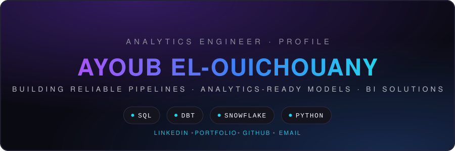
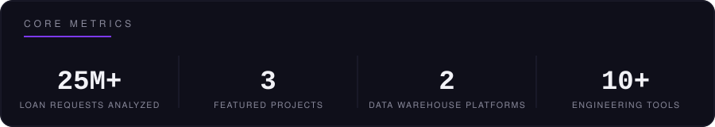
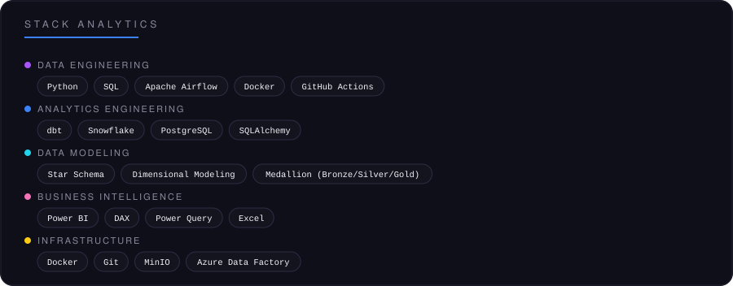
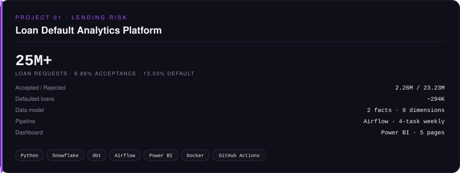
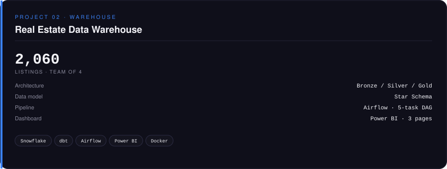
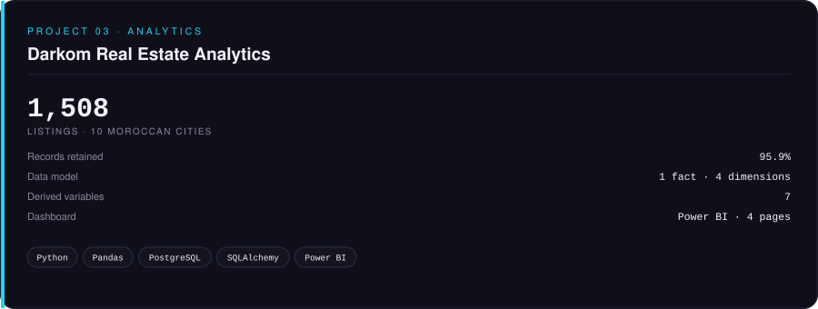
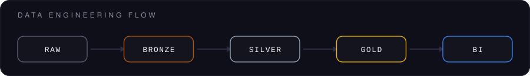

 

<a href="#core-metrics">CORE</a> ·
<a href="#stack">STACK</a> ·
<a href="#projects">PROJECTS</a> ·
<a href="#activity">ACTIVITY</a> ·
<a href="#github">GITHUB</a> ·
<a href="#connect">CONNECT</a>

---

<table width="100%">
<tr>
<td width="50%" valign="top">

</td>

<td width="50%" valign="top">

</td>
</tr>
</table>

---

<b>FEATURED PROJECTS</b>

 

<table width="100%">
<tr>

<td width="33%" valign="top">

</td>

<td width="33%" valign="top">

</td>

<td width="33%" valign="top">

</td>

</tr>
</table>

---

<b>DATA ENGINEERING FLOW</b>

 

---

<b>ACTIVITY PULSE</b> · LIVE GITHUB ACTIVITY · AUTO-UPDATED

 

---

<b>GITHUB METRICS</b> · AUTO-UPDATED DAILY

 

---

 

### CONNECT

<a href="https://www.linkedin.com/in/ayoub-el-ouichouany/">LINKEDIN</a>
&nbsp;·&nbsp;
<a href="https://data-engineer.me/">PORTFOLIO</a>
&nbsp;·&nbsp;
<a href="https://github.com/ayoub-data-analyst">GITHUB</a>
&nbsp;·&nbsp;
<a href="mailto:ayoub@data-engineer.me">EMAIL</a>

  

Analytics Engineer · SQL · dbt · Snowflake · Python · ETL/ELT · Data Modeling

 

Casablanca, Morocco · Simplon Maghreb

